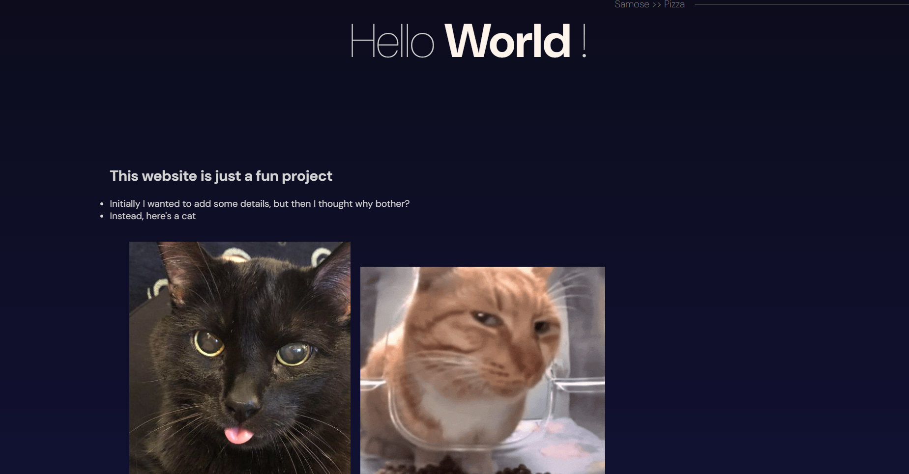

# Portfolio Site with ReactJS, Sass, and Framer Motion Parallax Effect

This portfolio site is built using ReactJS and utilizes Framer Motion library to create a visually appealing parallax effect. It is designed to showcase my projects, skills, and experience in a dynamic and interactive manner.

## Features

- **ReactJS**: The site is built using ReactJS, a popular JavaScript library for building user interfaces.
- **Framer Motion**: Framer Motion is used to create smooth animations and transitions throughout the site, including the parallax effect.
- **Responsive Design**: The site is responsive and works well across various devices and screen sizes.
- **Project Showcase**: A dedicated section to showcase my projects with details and links to their respective repositories or live demos.
- **Skills**: Highlighted sections to showcase my skills, experience, education, and any other relevant information.
- **Contact**: A contact section is included to allow visitors to get in touch with me easily.

## Installation

To run this project locally, follow these steps:

1. Clone the repository: 
    git clone https://github.com/Darth-InVader15/GUI_Portfolio.git

2. Navigate into the project directory
    cd GUI_Portfolio

3. Install dependencies:
    npm install

4. Start the development server: 
    npm run dev

5. Open your browser and visit `http://localhost:3000` to view the site.

## Usage

Feel free to customize this portfolio site according to your own projects, skills, and preferences. You can modify the content, styling, and animations to suit your needs.

## Contributing

Contributions are welcome! If you find any bugs or have suggestions for improvements, please open an issue or submit a pull request.

## License

This project is licensed under the [MIT License](LICENSE).

## Acknowledgements

- [Sass] (https://sass-lang.com/)
- [Framer Motion](https://www.framer.com/motion/)
- [Create React App](https://create-react-app.dev/)

## Contact

For any inquiries or questions, feel free to reach out to me at [your-email@example.com](mailto:piyush.singh1315@gmail.com).

